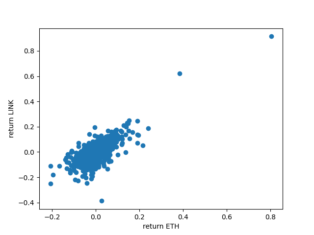
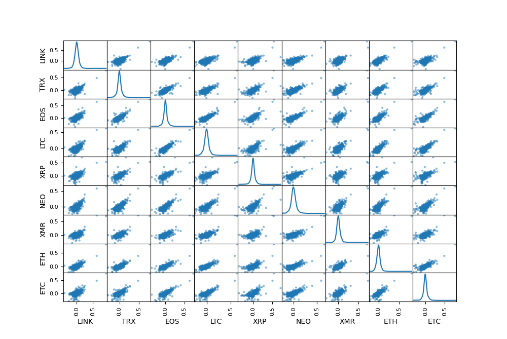
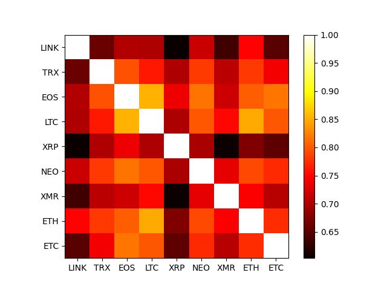

<!DOCTYPE html>
<html lang="en">
<head>
    <meta charset="UTF-8">
    
</head>
<body>
    <h1> Cryptocurrency analysis </h1>
    

     
 Collection of historical OHLC (Open/High/Low/Close) from pricing data (https://www.cryptodatadownload.com/data/binance/). 

  

    
  

  

    
  

  

    
  

    <h2> Python files </h2>
  <ul>
      <li> scraper.py</li>
      <li> simpleDataPipeline</li>
  </ul>
    <h2> Database file</h2>
    <ul>
     <li>crypto.db </li>

    </ul>
     <h2> Other files</h2>
    <ul>
     <li>  csv_files/*.csv </li>
    </ul>
   </ul>
     <h2>Description</h2>
    <ul>
        <li> analysis.py data visualization using crypto.db</li>
        <li>  simpleDataPipeline.py returns a database file containing a table for each cryptocurrency (csv file) and a
            table with
            closing prices for each crypto (cryptocurrencies displayed as columns, closing prices as rows).
        Output file: crypto.db </li>
         <li> scraper.py downloads Daily Historical OHLC (Open/High/Low/Close) in csv format.
         Output files: csv_files/*.csv</li>
    </ul>
</body>

